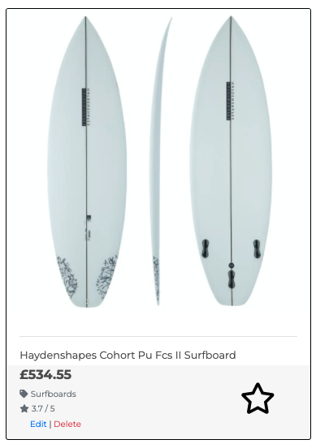
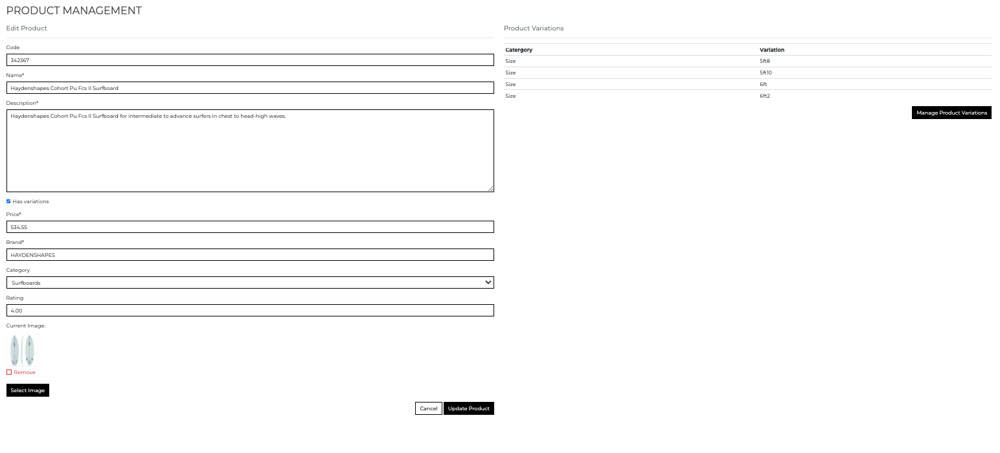

# Sea & Shore Store


# Project Synopsis


[See the live site here!](https://sea-and-shore-store.herokuapp.com/)

___
# User Experience (UX)

## User Stories

### Unregistered user goals

- As an unregistered user, I should be able to see what the store is selling and easily understand the kind of products on offer.
- As an unregistered user, I should be able to navigate through the website easily to explore the different features.
- As an unregistered user, I should be able to navigate through all the products sold in the store using clear and intuitive menus and categories.
- As an unregistered user, I should be able to search the product range.
- As an unregistered user, I should be able to sort any product results by price, rating, or brand.
- As an unregistered user, I should be able to add items to my basket and receive real-time, useful feedback when I interact with the website.
- As an unregistered user, I should be able to edit the items in my basket and receive feedback when something has changed.
- As an unregistered user, I should be able to check out as a guest user of the website.
- As an unregistered user, I should be able to receive email confirmation of my order. 
- As an unregistered user, I should be able to sign up and store my information to a personal profile in order to streamline future visits.

### Registered user goals

- As a registered user, I should be able to log in to my profile to make my experience more personal.
- As a registered user, I should be able save items to a wish-list for future purchase consideration. 
- As a registered user, I should be able to edit my default delivery and payment information. 
- As a registered user, I should be able to see and review my past orders.
- As a registered user, I should be able to rate and leave reviews for products on the site.
- As a registered user, I should be able to contact the business owner with any queries I might have.

### Future Dev

- As a registered user, I should be able to read about the latest products being tested by the business team on the blog.
- As a registered user, I should be able to leave comments on the blog posts to offer my opinions / advice to other users of the website. 
- As a registered user, I should be able to have products recommended to me based on my order history.

### Admin

- As an admin user, I should be able to add, edit and delete items from the product range.
- As an admin user, I should have access to an admin section to see details of users and orders.
- As an admin user, I should be able to offer incentive to make larger purchases by offering free delivery over a set amount.

- As an admin user, I should be able to interact with my frequent customers using the blog and comments section and offer advice and real-world testing of selected products in the store.


## Design

### Wireframes
- [Landing Page](https://github.com/timmorrisdev/ms4-sea-and-shore-store/blob/main/readme_assets/wireframes/Home%20page.png)
- [Product Page](https://github.com/timmorrisdev/ms4-sea-and-shore-store/blob/main/readme_assets/wireframes/Product%20Page.png)
- [Product Detail](https://github.com/timmorrisdev/ms4-sea-and-shore-store/blob/main/readme_assets/wireframes/Product%20Detail.png)
- [Shopping Bag](https://github.com/timmorrisdev/ms4-sea-and-shore-store/blob/main/readme_assets/wireframes/Shopping%20bag.png)
- [Checkout](https://github.com/timmorrisdev/ms4-sea-and-shore-store/blob/main/readme_assets/wireframes/Checkout.png)
- [User Profile](https://github.com/timmorrisdev/ms4-sea-and-shore-store/blob/main/readme_assets/wireframes/User%20Profile.png)
- [Wishlist](https://github.com/timmorrisdev/ms4-sea-and-shore-store/blob/main/readme_assets/wireframes/Wishlist.png)
- [Add / Edit Product](https://github.com/timmorrisdev/ms4-sea-and-shore-store/blob/main/readme_assets/wireframes/Add_Edit%20Product.png)
- [Add / Edit Review](https://github.com/timmorrisdev/ms4-sea-and-shore-store/blob/main/readme_assets/wireframes/Add%20review.png)


### Colour Scheme
 - I chose an image for the home page that would be both visually beautiful, and convey the purpose of the site to the user. Then throughout the site I chose to keep the colour scheme neutral. Using contrasting black and white elements to create a clean, modern feel and user experience. 


### Fonts
- I chose Montserrat from google fonts for the site as it gives good readability and has a modern asthetic.


## Data Models and Schema
### Models
 - Products App
    - Product: Holds the information for each individual product.
    - Category: Holds the available categories for the products.
    - Product Variations: Any variations of a specific product (sizes etc)

- Checkout App
    - Order: Holds the order information and details of the customer who placed it.
    - Order Line Item: Each item within a specific order. 

- User
    - Created with django allauth containing the customer username, email and password.

- User Profile App
    - User Profile: Holds user default delivery information

- Wishlist App
    - User Wishlist: Holds any items a specific user places into a wishlist.

- Product Review App
    - Holds any reviews added for a specific product. Details the user that left each review.

### Database Diagram

This is a diagram of the database show the relations between each model. It was made using [dbdiagram.io](https://dbdiagram.io/).


## Features

### Home Page
- Overview
    - Large 'hero' image is visually striking as well as providing the user with context to the kind of store it is.
    - Clear navigation and streamlined design make it easy for the user to make decisions about their journey through the site.

    


- Navigation and Search
    - Search function for all products and navigation links with drop-down menus for each category 'group'. 

    

- Site Feature Icons
    - Clear, bold icons to allow the user to navigate user and shopping bag features.

    

- Browse Button
    - Main 'onward-journey' prompt for the user if they are not looking for a specific product using the navigation or search.

    


### Products Page

- Overview
    - Product page displays summary cards for relevant products dependent on criteria entered by the user. Either search parameter or category navigation.

    

- Product Summary Card
    - Summary of product while user is browsing. Delivers an overview of the product details including image, name, price, rating, and wishlist status via star icon.

    

- Search Result Feedback
    - The user is provieded detail of how many products they are currently viewing based on their criteria.

    

- Sort Selector
    - Dropdown menu allowing the user to determine the ordering of the products they are viewing to make the results meet their needs more easily.

    

- Pagination
    - This area of the site uses the pagination feature included in the ListView clas based view in Django. It allows the user to navigate their search results in a more manageable way.

    


### Product Detail Page

- Product Details Section
    - Provides the user with a detailed overview of the specific product. 
    - Product rating uses the average of any ratings issued in product reviews and is calculated in the product review app views.
    - Includes the buttons and menus for the user to select a specific size (if applicable) and add a defined quantity of the item to the shopping bag.
    - 'Star' icon informs the user if the proudct is in their wishlist and acts as a toggle button to add / remove it to the wishlist.

    

- Products Review Section
    - Displays any user reviews for the specific product.
    - If the user in logged in, the 'add review' link is available and active.
    - Edit / Delete buttons available to the review author. 

    

- Add Product Review
    - If the user is logged in and has clicked to add a review to a product, the following form page will be displayed. 
    - The same form is displayed for a user to edit a review, pre-popluated with the review data being edited.

    

- Shopping Bag Page
    - Displays the details of all items in the users shopping bag.
    - Offers the ability to update item quantity, or remove an item from the shopping bag.
    - Displays bag total and shipping fees, if the user has not met the free delivery threshold.
    - Navigation buttons to either checkout, or keep shopping.

    

- Checkout Page
    - Prompts the user to input their shipping and payment information.
    - Displays order summary.

    

    - Allows the user to save the information being entered to their profile if they are registered and logged in.

    

    - Upon successful checkout, user is redirected to a success page with an overview of the order and the shipping information.

    

- User Profile
    - Displays the users default infomation to be pre-populated at checkout and offers the ability to edit.
    - Order history gives an overview of any orders placed. User can click an order to display the order confirmation for the past order.

    

- Wishlist Page
    - If user has added items to their wishlist, the product summary card for each item is displayed.

    

    - If the user has not added any items to the wishlist, the page will display feedback to  reflect this.

    

- Admin Product Management
    - Add prodict form for admin to input a new product to the store.
    - If 'has variations' is selected, sumbitting the form will redirect the admin to add variations of the product.

    

    - Add product variations page displays existing variations and offers the admin the ability to add additional variations as well as edit and delete existing variations.

    

    - Edit existing product form.
    - Pre-populated with current product details.
    - Displays any product variations and displays link to manage.

    

- Allauth Registration, Sign In and Sign Out
    - Registration page.
    - User is required to confirm email address using a link in an automated email sent to the provided address.

    

    - Sign In page

    

    - Sign Out Page

    

- Django Messages
    - The user is given feedback on any action taken on the site via django message popups using Bootstrap toasts.
    - Item successfully added to bag.

    
    
    - Order confirmation

    

    - Item successfully added to wishlist.

    


### Other Features
- Responsive across all devices and screen sizes.
- Adaptive to modify content shown to be appropriate for user device or screen size.

### Future Development Opportunities

___
# Technologies Used
## Languages Used
- [Python3](https://www.python.org/downloads/)
- [JavaScript](https://www.javascript.com/)
- [CSS3](https://en.wikipedia.org/wiki/CSS)
- [HTML5](https://en.wikipedia.org/wiki/HTML5)

## Django and Associated Extensions

- [Django](https://www.djangoproject.com/)
    - Django was was used to create the project and code infrastructure. Django templating language was used when passing data between the Front-end and Back-end.

- [Django Allauth](https://django-allauth.readthedocs.io/en/latest/installation.html)
    - Allauth was used to create user registration and login functionality.

- [Django Countries](https://pypi.org/project/django-countries/)
    - Django Countries was used for formatting of the 'Country' field in the checkout form and in the default user info within the profile section.

-[Django Crispy Forms](https://django-crispy-forms.readthedocs.io/en/latest/)
    - Used to format the default django form fields across the site.

- [Django Coverage](https://pypi.org/project/django-coverage/)


## Frameworks, Libraries & Programs Used

- [jQuery](https://jquery.com/)
    - jQuery was used across the site when additional steps were needed to pass appropriate data to the back end, as well as when overridng some of the default behaviours and styling of django elements
    - jQuery was also used as part of Bootstrap and is used for Javascript plugins such as the modals.

- [Heroku](https://www.heroku.com/)
    - Heroku was used to deploy the site. The Heroku Postgres add-on was also used to create the production database for the project.

- [Stripe](https://stripe.com/gb)
    - Stripe was used to handle payments made on the site. Stripes webhooks were also used to offer payment backup in the event of payment failure. 

- [AWS(Amazon Web Services)](https://aws.amazon.com/)
    - Amazon Web Services was used to host the static files and media files used by the site.

- [Google Fonts](https://fonts.google.com/)
    - Google Fonts was used to import the 'Montserrat' font, which was used throughout the site.

- [Font Awesome](https://fontawesome.com/)
    - Used to source icons used across the site.

- [Git](https://git-scm.com/)
    - Git was used for version control using the terminal in Gitpod to 'add' and 'commit' to Git and to push changes to the GitHub repository using 'git push'.

- [Gitpod](https://gitpod.io/)
    - Gitpod.io was used as the primary development environment when coding for the site. It's terminal was used to preview the site via temporary server, and for version control using Git commands.

- [Github](https://github.com/)
    - GitHub was used to store the code pushed from Gitpod and as deployment for the [published site.](https://sea-and-shore-store.herokuapp.com/)

- [Balsamiq](https://balsamiq.com/)
    - Balsamiq was used to create the wireframes for the site while in the 'skeleton' stage of my UX process.

- [Autoprefixer](http://autoprefixer.github.io/)
    - Autoprefixer was used in the final stage of development to parse CSS code and add vendor prefixes.

- [Am I Responsive?](http://ami.responsivedesign.is/#)
    - Used to check responsiveness across different device sizes. 

___
# Testing
## Responsiveness Testing
I used google dev tools throughout the development process to check responsiveness across different screen sizes. 

I was also sure to deploy the site to Heroku early in development to allow for review of the live site on various devices throughout the process.

## W3C Markup, CSS Validation & JSHint Validation
I used the W3C Markup, CSS Validator and JSHint Validator Services to check and validate each page throughout the site to check for errors. 
### [Markup Validation Service](https://validator.w3.org/)
The validator found the following issues for me to address.

### [CSS Validation Service](https://jigsaw.w3.org/css-validator/)
My CSS file style.css passed through the w3 validator with no errors.

### [JSHint Validation Service](https://jshint.com/)
My JavaScript file script.js passed through the validator with no errors. 

### [PEP8 check](http://pep8online.com/checkresult)

Other than those issues, my python code was fully PEP8 compliant.

## Lighthouse Testing

## Testing UX User Stories

### Unregistered user goals

### Registered user goals

### Admin user goals

## Peer Code Review


## Cross-Browser/Device Testing
I tested the site across multiple devices using different browsers.
- Browsers tested
    - Chrome
    - Safari
    - Firefox

- Devices tested
    - Mac Pro w/ Dell 24 inch monitor
    - Macbook Pro 15 inch
    - iPhone 12
    - iPad air 2

## Known Bugs / Issues


# Deployment

The project was deployed to Heroku and can be found [here](https://sea-and-shore-store.herokuapp.com/).

The following steps were taken throughout the project to achieve deployment of the live site.

## Create Github Repository

- The repository was created using the green 'new' button on [Github](https://github.com/) and selecting the Code Institute Full Tempalte from the dropdown menu. 
- Once created I was able to open the repository in Gitpod using the installed extension. From this point on, the command line in Gitpod was used for version control with git add, commit and push commands.


## Create Django Application
In the terminal type the following commands to create and initialise the project:
    
- Install Django
    ```
    pip3 install django
    ```

- Create project-level application
    ```
    django-admin startproject [project_name] .
    ```

- Create Superuser to access the Django admin panel. Follow the prompts to input a username, email and password.

Note: This step will be repeated when deploying to Heroku and migrating the database to Postgres.

    ```
    python3 manage.py createsuperuser
    ```
- Install apps to impliment site features.

    ```
    python3 manage.py startapp [app_name]
    ```

## Deployment to Heroku

In order to deploy the app via [heroku](https://dashboard.heroku.com/apps), the following steps must be taken. 

### Heroku
- Navigate to [heroku](https://heroku.com/) and create a new app in your dashboard.

- Assign an app name and region and hit 'create app'.

- Navigate to the resourses tab from the app dashboard, search for Postgres and select to add to the project.

### Django

- To use Postgress, install the following packages.

    ```
    pip3 install dj_database_url
    ```
    ```
    pip3 install psycopg2_binary
    ```
- Add the packages to the requirements.txt file using the following command.

    ```
    pip3 freeze > requirements.txt
    ```

- In settings.py:
    - import dj_database_url.

    ```python
    import dj_database_url
    ```
    - Replace settings for the development database with the following code. Note that the database url is obtained using an environment variable set up in Heroku to avoid exposing the database when pushing to Github. The database settings were also placed in a conditional statement to allow use of development database if necessary.

    ```python
    if 'DATABASE_URL' in os.environ:
        DATABASES = {
            'default':dj_database_url.parse(os.environ.get('DATABASE_URL'))
        }
    else:
        DATABASES = {
            'default': {
                'ENGINE': 'django.db.backends.sqlite3',
                'NAME': os.path.join(BASE_DIR, 'db.sqlite3'),
            }
        }
    ```

- Create fixtures files to be installed in the new database. FOr my project I required data already added for the Product, Category and ProductVariation models.
    ```

        python3 manage.py dumpdata products.Product > products.json

        python3 manage.py dumpdata products.Category > category.json

        python3 manage.py dumpdata products.ProductVariations > product_variations.json
    ```

- Migrate the project models to database.
    ```
    python3 manage.py migrate
    ```

- Use the created fixtures files to add the product data to the database. Note that the order is important to allow model relationships to be made corectly.

    ``` 
    python3 manage.py loaddata category
    python3 manage.py loaddata products
    python3 manage.py loaddata product_variations
    ```
- Create superuser for the production database and admin panel. Follow the prompts to input a username, email and password.

    ```
    python3 manage.py createsuperuser
    ```

- The Postgress database is now set up and configured.

- Install Gunicorn and create Procfile.
    ```
    pip3 install gunicon
    ```
    ```
    touch Procfile
    ```
- Within the Procfile, place the following code.
    ```
    web: gunicorn sea_and_shore.wsgi:application
    ```

- Login to Heroku and prevent static files being collected until AWS is setup.
    ```
    heroku login -i
    ```
    ```
    heroku config:set DISABLE_COLLECTSTATIC=1 --app <app name>
    ```

- Add Heroku to the allowed hosts in settings.py. 'Localhost' is kept in place for use in future development.
    ```python
    ALLOWED_HOSTS = ["[heroku_app_name].herokuapp.com", "localhost"]
    ```

- Set up remote to Heroku app and push files to Heroku.
    ```
    heroku git: remote -a [heroku_app_name]
    ```
    ```
    git push heroku main
    ```

- On Heroku.com, navigate to the deploy tab of the app dashboard to locate the project Github repository and enable automatic deployment from future pushes to Github.

### Amazon Web Services (AWS)

Amazon Web Services was used to host the static files and media files for the site.

- Follow the steps on the [AWS website](https://aws.amazon.com/) to create a new account and sign in.

- Search for and navigate to the S3 service and follow the following steps to create a new 'bucket'
    - In the S3 dashboard, click the 'create bucket' button.
    - Give the bucket a name, select the region nearest to your location and un-check the 'block public access' settings checkbox.
    - Hit 'create bucket'

- Configure the properties for the bucket.
    - In the properties tab of the bucket, navigate to the 'Static website hosting' section and click edit.
    - Enable Static website hosting using the checkbox.
    - Input the default index and error documents as 'index.html' and 'error.html'.
    - Save changes.

- Configure the permissions for the bucket.
    - In the permissions tab of the bucket.
    - Select edit in the Cross-origin resource sharing(CORS) section and
     pPaste the following code into the CORS configuration section.
    ```
    [
        {
            "AllowedHeaders": [
                "Authorization"
            ],
            "AllowedMethods": [
                "GET"
            ],
            "AllowedOrigins": [
                "*"
            ],
            "ExposeHeaders": []
        }
    ]
    ```
    - Back in the permissions menu, hit edit on the bucket policy section and select 'generate policy'.
        - Select policy type of 'S3 bucket policy'
        - Allow all principles by entering a '*' in the Principal field.
        - Select 'get object' from the action dropdown.
        - Copy the 'arn' from the edit bucket policy page and paste into the Amazon Resource Name (ARN) field.
        - Click 'add statement'
        - Click generate policy and copy the code.
        - Paste the code into the policy field in the edit bucket policy section, adding a '/*' to the recource line.
        - Hit save.
    

    - Navigate to the 'edit access control list (ACL) section and grant 'list' access for everyone by selecting the checkbox.

- Create a user to access the S3 bucket using IAM.
    - Navigate to the IAM page from the AWS dashboard.
    - Create group.
        - Select 'group' from the menu and click to create a new group, following the instructions to name and then create.
    - Create policy
        - Select 'policies' from the menu and click 'create policy'.
        - Select the 'JSON' tab and click 'import managed bucket'.
        - Search for, and import the 'S3 full access' policy.
        - Copy the ARN from the bucket policy section and paste this in as the 'Resource' value.
        - Click 'review policy' and give it a name and description and hit 'create policy.
    - Add policy to group.
        - Navigate to the groups menu and select the group.
        - Click 'attach policy', search for the newly-created policy from the previous step.
        - Selct the policy using the checkbox and click 'attach policy'
    - Create user
        - Select 'users' from the menu and click 'add user'.
        - Name the user and grant programatic access using the checkbox.
        - Select the group created in the previous steps.
        - Click through to the end of the options and click 'create user'
        - Download and save the user CSV file.

- Connect Django to S3
    - Install packages Boto3 and Django storages and add to our requirements.txt file.
    ```
    pip3 install boto3
    ```
    ```
    pip3 install django-storages
    ```
    ```
    pip3 freeze > requirements.txt
    ```
    - Add 'storages' to the installed apps in settings.py.
    - Add the following settings to settings.py. Note the 'USE_AWS' environment variable will be added to Heroku to allow use of AWS only when desirable.
    ```python
    if 'USE_AWS' in os.environ:
    # Cache control
    AWS_S3_OBJECT_PARAMETERS = {
        'Expires': 'Thu, 31 Dec 2099 20:00:00 GMT',
        'CacheControl': 'max-age=94608000',
    }

    # Bucket Config
    AWS_STORAGE_BUCKET_NAME = '[bucket name]'
    AWS_S3_REGION_NAME = 'eu-west-2'
    AWS_ACCESS_KEY_ID = os.environ.get('AWS_ACCESS_KEY_ID')
    AWS_SECRET_ACCESS_KEY = os.environ.get('AWS_SECRET_ACCESS_KEY')
    AWS_S3_CUSTOM_DOMAIN = f'{AWS_STORAGE_BUCKET_NAME}.s3.amazonaws.com'

    # Static and media files
    STATICFILES_STORAGE = 'custom_storages.StaticStorage'
    STATICFILES_LOCATION = 'static'
    DEFAULT_FILE_STORAGE = 'custom_storages.MediaStorage'
    MEDIAFILES_LOCATION = 'media'

    # Override static and media URLs in production
    STATIC_URL = f'https://{AWS_S3_CUSTOM_DOMAIN}/{STATICFILES_LOCATION}/'
    MEDIA_URL = f'https://{AWS_S3_CUSTOM_DOMAIN}/{MEDIAFILES_LOCATION}/'
    ```
    - Add the environment variables 'AWS_ACCESS_KEY_ID' and 'AWS_SECRET_ACCESS_KEY' to Heroku with the values found the user CSV file downloaded from the AWS setup.

    - Create custom_storages.py at the top-level of the project and input the locatioons for Django to store the files.
    ```python
    from django.conf import settings
    from storages.backends.s3boto3 import S3Boto3Storage


    class StaticStorage(S3Boto3Storage):
        location = settings.STATICFILES_LOCATION


    class MediaStorage(S3Boto3Storage):
        location = settings.MEDIAFILES_LOCATION
    ```

- With all these settings complete, remove the 'DISABLE_COLLECTSTATIC variable from Heroku and AWS is ready to use.

- Add media to AWS
    - Navigate to the S3 bucket on the AWS site.
    - Click to create a new folder and name it 'media'
    - Within the folder, click the button to upload files and add any relevant site media.
    - Under permissions, select to grant public read access.
 


## Forking the repository in GitHub
Forking the repository creates a copy of the original repository in your own account to allow changes to be made without affecting the original repository.
1. Log in to GitHub and navigate to the GitHub repository page [here](https://github.com/timmorrisdev/ms4-sea-and-shore-store).
2. In the top-right of the page, below the user avatar, locate the "fork" button.
3. Click the "fork" button and you should now have a copy of the repository in your own account. 

## Making a Local Clone
Details of how to make a local copy of the GutHub repository can be found [here](https://docs.github.com/en/github/creating-cloning-and-archiving-repositories/cloning-a-repository). To clone using HTTPS follow these steps.
1. Navigate to the GitHub repository [here](https://github.com/timmorrisdev/ms4-sea-and-shore-store).
2. Click the "Code" drop-down menu above the list of files.
3. Copy the HTTPS address to the clipboard using the button provided.
4. Open Terminal.
5. Change the current directory to the location you wish to copy the directory.
6. Type 'git clone' and then paste the HTTPS url you copied earlier. 
7. Press enter and your local clone will be created. 

___
# Credits
## Code

- The code and concept for this project is based around the 'Boutique Ado' learning walkthrough project by the Code Insitute.
- The following youtube videos were used as additional learning for aspects of the code.
    - [Very Academy ecommerce wishlist](https://www.youtube.com/watch?v=OgA0TTKAtqQ)
    - [Just Django Class Based views](https://www.youtube.com/watch?v=S1wMmFFefRM)
    - [Coding Point ecommerce walkthrough](https://www.youtube.com/watch?v=UjisbVs6gww)
    - [Dennis Ivanov Class Based views](https://www.youtube.com/watch?v=RE0HlKch_3U)
- [Stack Overflow](https://stackoverflow.com/) was used extensively when problem solving. Specifically the following threads.
    - [Check if image url exists](https://stackoverflow.com/questions/10543940/check-if-a-url-to-an-image-is-up-and-exists-in-python)
    - [Add wishlist](https://stackoverflow.com/questions/56580696/how-to-implement-add-to-wishlist-for-a-product-in-django)
    - [Specify login required redirect](https://stackoverflow.com/questions/3578882/how-to-specify-the-login-required-redirect-url-in-django)
    - [Select distinct values from table field](https://stackoverflow.com/questions/2466496/select-distinct-values-from-a-table-field)
    - [Redirect to same page after POST request](https://stackoverflow.com/questions/39560175/redirect-to-same-page-after-post-method-using-class-based-views)

- The [Django documentation](https://docs.djangoproject.com/en/4.0/) was used a lot while working on the project. Especially when researching class based views.

## Content

- Product information taken from the existing ecommerce store [Surfdome](https://www.surfdome.com/).

## Media

- Product images downloaded from [Surfdome](https://www.surfdome.com/) ecommerce store.
- Background image by [Will Truettner from unsplash](https://unsplash.com/photos/Rk-JT2OypZA).

## Acknowledgements
- Thank you to my mentor, Rohit Sharma for all your guidance and support.
- Thank you to the Code Institute tutor support and Slack community for all the help throughout this project.
